# 🌐 Sandeep Mortha Portfolio

<p align="center">
  
  
  
  
</p>

## 📌 Live Demo

🚀 **Portfolio Website**

👉 https://mortha-sandeep-portfolio.vercel.app/

---

# 📖 About

Welcome to my personal portfolio website.

This portfolio showcases my

- 👨‍💻 About Me
- 🎓 Education
- 💼 Skills
- 🚀 Projects
- 📜 Certifications
- 📞 Contact Information
- 🌙 Responsive Modern UI

Built using modern frontend technologies for speed and responsiveness.

---

# 🛠️ Tech Stack

- React.js
- Vite
- JavaScript
- HTML5
- CSS3
- Tailwind CSS
- EmailJS
- Vercel

---

# 📸 Screenshots

## 🏠 Home Page

<p align="center">
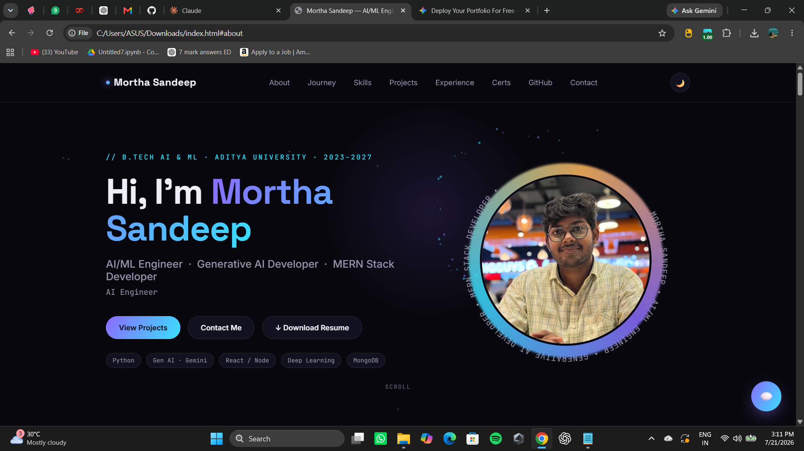
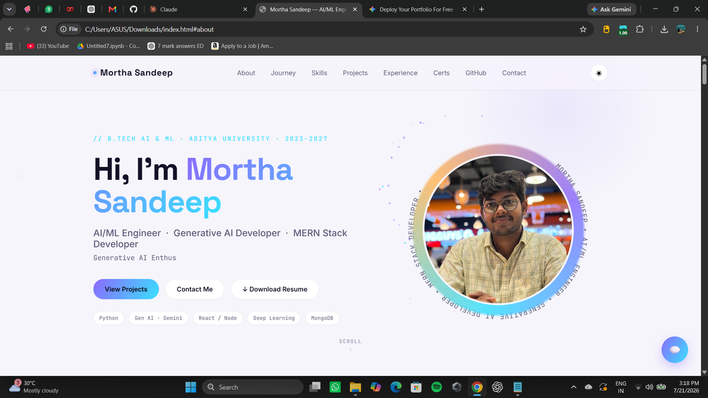
</p>

---

## 👤 About Section

<p align="center">
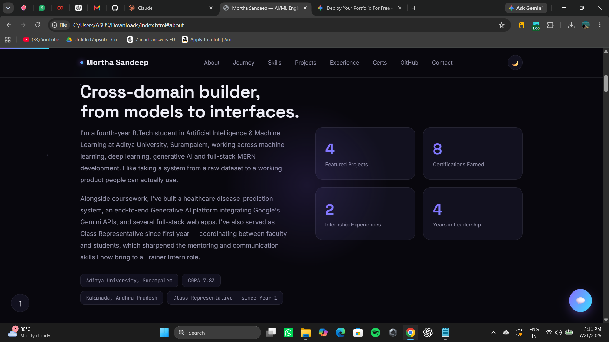
</p>

---

## Other images
<p align="center">

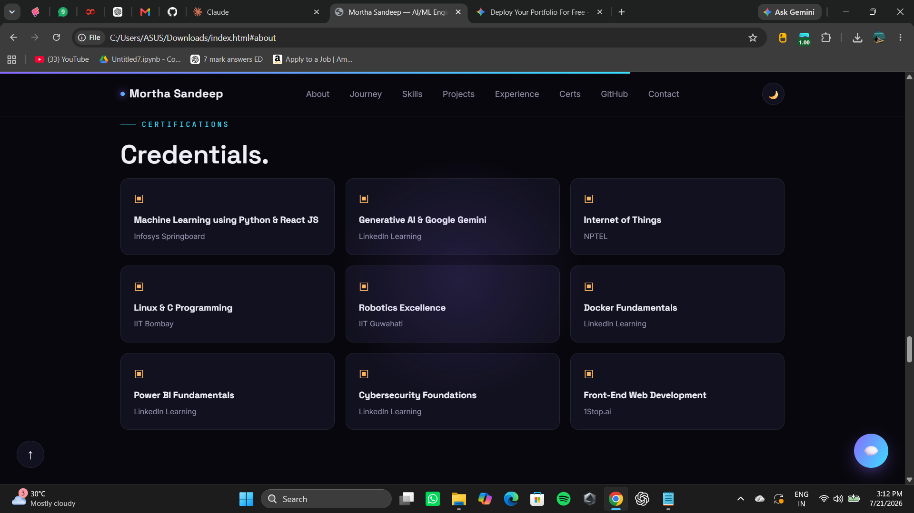
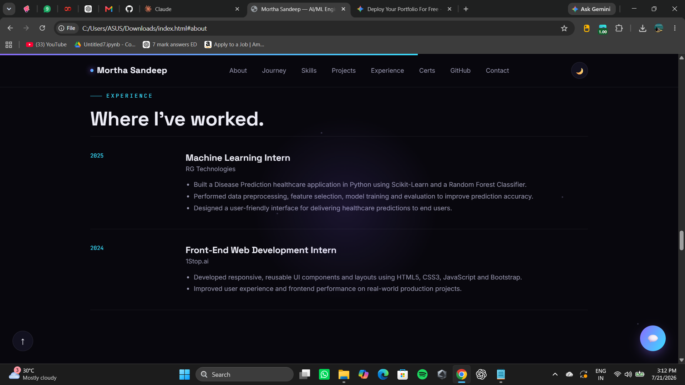 
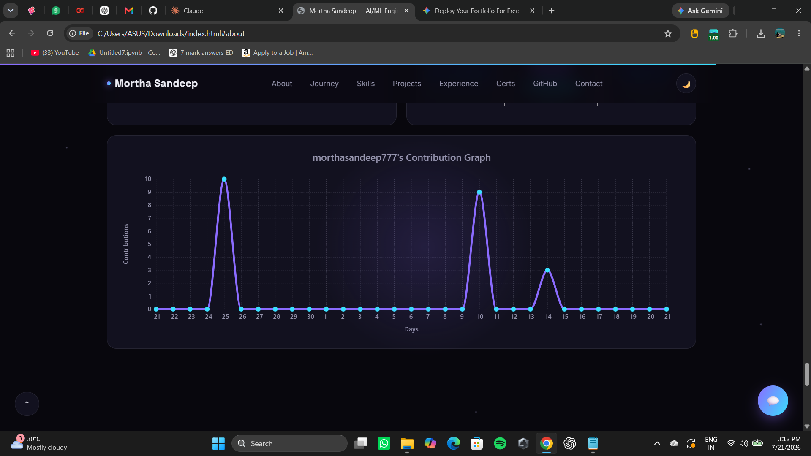
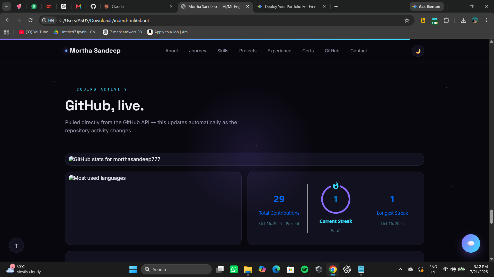
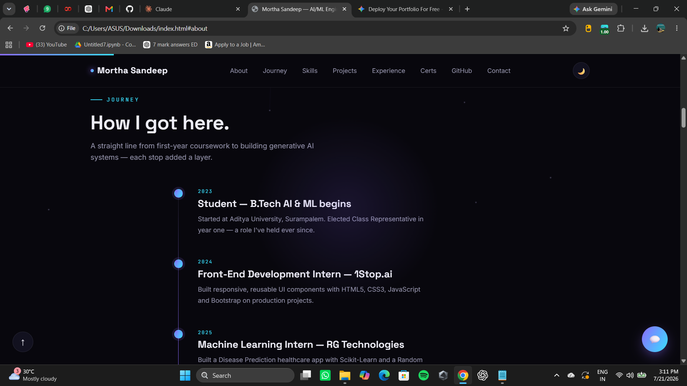
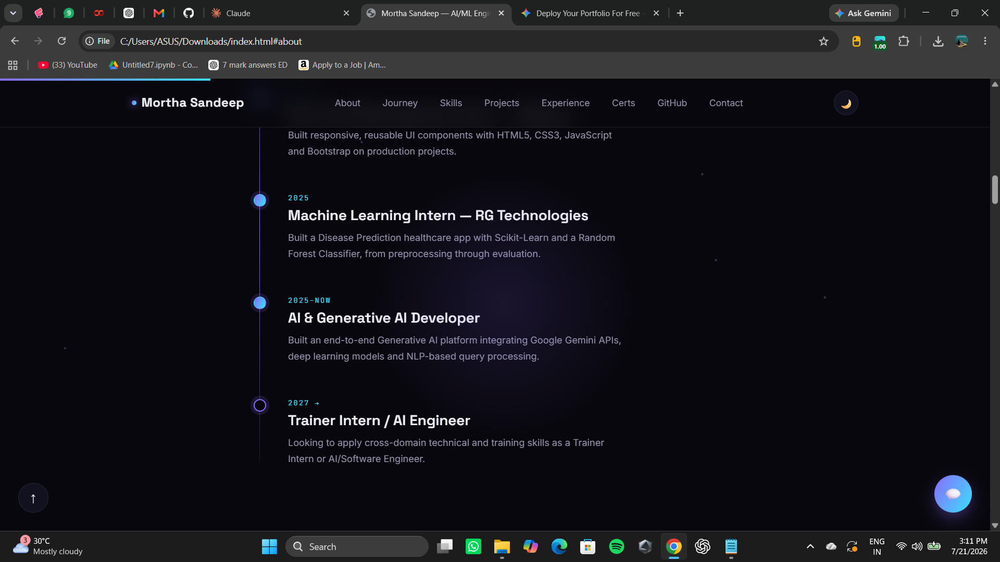
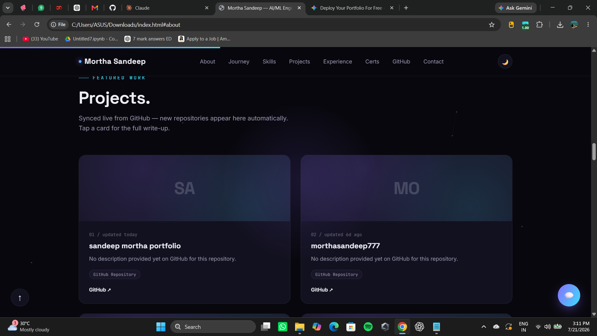
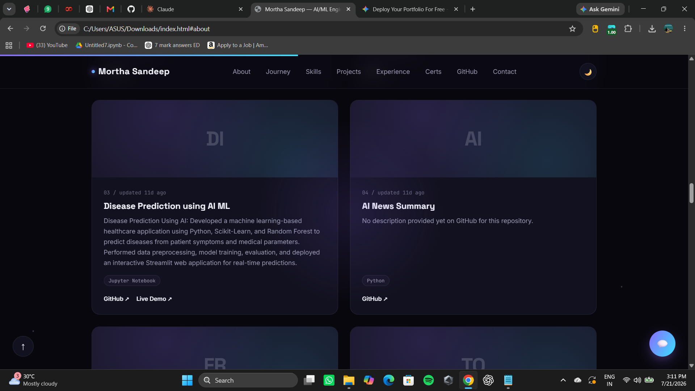
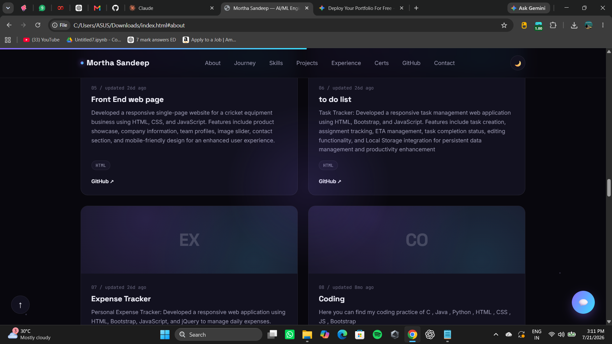
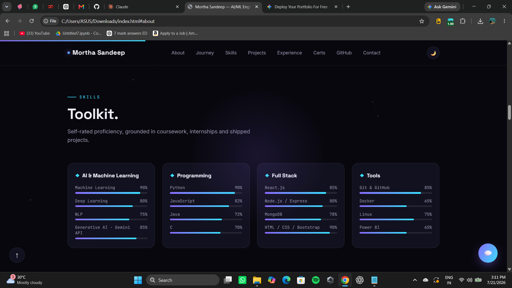
</p>


## 📞 Contact Section

<p align="center">
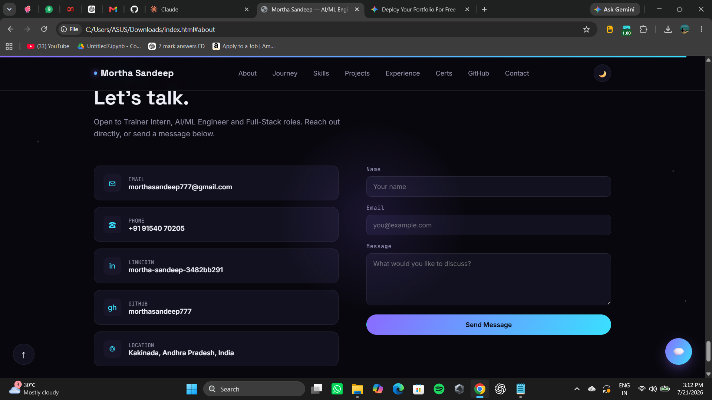
</p>

---

# ✨ Features

- Modern UI Design
- Fully Responsive
- Dark Theme
- Smooth Scrolling
- Animated Components
- Project Showcase
- Skills Display
- Contact Form
- Mobile Friendly
- Fast Performance

---

# 📂 Folder Structure

```
Portfolio/
│
├── public/
├── src/
│   ├── assets/
│   ├── components/
│   ├── pages/
│   ├── App.jsx
│   └── main.jsx
│
├── screenshots/
│   ├── home.png
│   ├── about.png
│   ├── skills.png
│   ├── projects.png
│   └── contact.png
│
├── package.json
└── README.md
```

---

# ⚙️ Installation

Clone the repository

```bash
git clone https://github.com/morthasandeep777/sandeep-mortha-portfolio.git
```

Go into the project

```bash
cd sandeep-mortha-portfolio
```

Install dependencies

```bash
npm install
```

Run locally

```bash
npm run dev
```

---

# 🚀 Deployment

This project is deployed on **Vercel**

Live Website

👉 https://mortha-sandeep-portfolio.vercel.app/

---

# 📈 Future Improvements

- Blog Section
- Download Resume
- Theme Switcher
- Project Filtering
- Visitor Counter
- GitHub Contributions
- Testimonials
- Admin Dashboard

---

# 👨‍💻 Author

**Mortha Sandeep**

Artificial Intelligence & Machine Learning Student

📧 Email: your-email@example.com

🌐 Portfolio

https://mortha-sandeep-portfolio.vercel.app/

GitHub

https://github.com/morthasandeep777

LinkedIn

https://linkedin.com/in/your-linkedin

---

# ⭐ Support

If you like this project,

⭐ Star this repository

🍴 Fork it

📝 Share it

---

<p align="center">
Made with ❤️ by <b>Mortha Sandeep</b>
</p>
